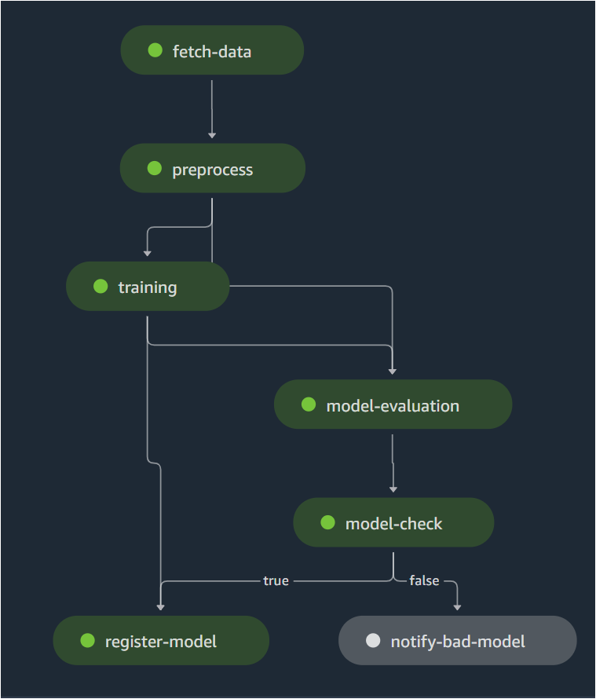

# ml-pipeline

This repo exists to orchestrate end-to-end ml-training workflow in AWS sagemaker that would allow continuous model retraining periodically and maintain traceability and model quality using orchestration best practices.  





## Guide
* Edit the repo name and/or region in ```Makefile``` 
* Create a ```local_credentials.env``` file (do not share it or add to git or push to ECR) with values for:
    * AWS_ACCESS_KEY_ID
    * AWS_SECRET_ACCESS_KEY
    * AWS_DEFAULT_REGION
    (Optionally for above you can setup AWS credentials)

    
### Get help functions

```shell 
make help
```

### Setup
```shell
make setup
```

### Create ECR repo
```shell
make create-ecr-repo
```


### Build, tag and push container to ECR
```shell
make all
``` 

### Orchestrate workflow in sagemaker
```shell
make orchestrate
```
